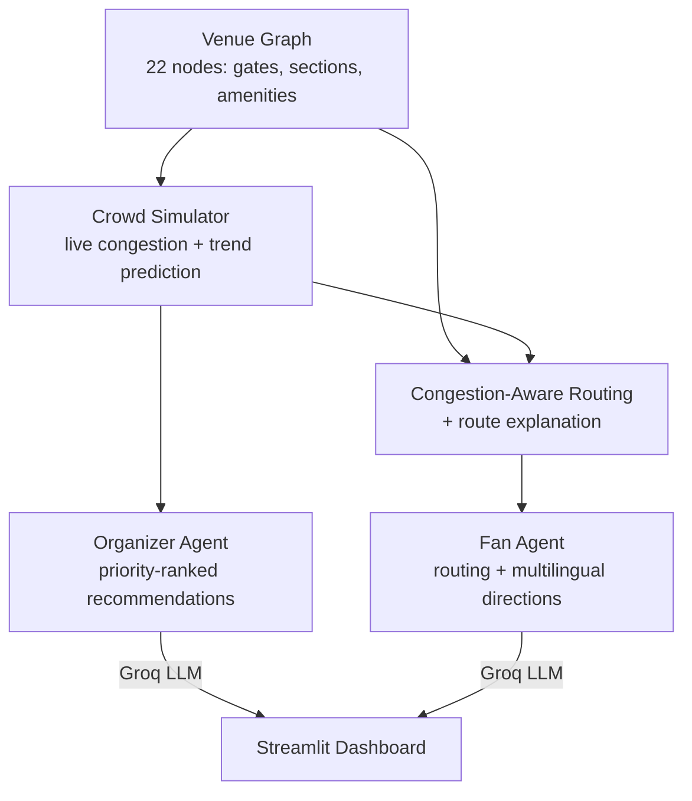

# 🏟️ StadiumMind

**A GenAI-powered command center for smart stadiums — one shared crowd-intelligence layer that powers both organizer decisions and fan navigation.**

Built for the PromptWars 2026 "Smart Stadiums & Tournament Operations" challenge.


---

## The Idea

Most crowd-management solutions treat "help organizers" and "help fans" as two separate features bolted together. StadiumMind treats them as **one system**:

- A **venue graph** models the stadium — gates, seating sections, restrooms, food courts, medical room, parking, and more.
- A **live crowd simulator** tracks congestion at every location (standing in for real sensors/cameras), including short-term trends.
- The **Organizer Agent** reads that data and gives staff a prioritized, structured action plan in real time.
- The **Fan Agent** reads the *exact same* data to route fans through the *least crowded* path to wherever they're going — and explains why that route was chosen.

Same data, two agents, one story: whatever tells an organizer "Gate B is about to be a problem" is the same intelligence quietly routing fans away from Gate B before they even notice.



---

## Features

**📊 Organizer Dashboard**
- Live, color-coded congestion map (interactive, auto-refreshing)
- Predictive trends — not just "85/100 congested" but "up 22% recently, ~3 updates from critical"
- Structured incident logging (description, location, severity, timestamp), sorted by urgency
- AI-generated, priority-ranked recommendations with simulated impact estimates

**🧭 Fan Assistant**
- Congestion-aware routing — dynamically avoids crowded areas, not just the shortest path
- Plain-English explanation of *why* a route was chosen
- Multilingual directions (English, Hindi, Spanish, French)

**♿ Accessibility**
- Every congestion score is shown as visible text, not conveyed by color alone
- Text-table and step-by-step list equivalents for every visual chart

**🔌 Runs without an API key**
- Ships with a fully-functional mock mode — the whole app works end-to-end with realistic, data-driven placeholder responses even with no LLM key configured. Add a real key and it switches to live AI output automatically.

---

## Tech Stack

Python · Streamlit · NetworkX · Plotly · Groq (Llama 3.3 / 3.1)

---

## Project Structure

```
stadiummind/
├── core/
│   ├── venue.py          # The stadium as a graph
│   ├── crowd_sim.py       # Live congestion + trend simulation
│   ├── routing.py         # Congestion-aware pathfinding + route explanation
│   ├── incidents.py       # Structured incident model
│   ├── graph_layout.py    # Positions nodes for visualization
│   └── visualization.py   # Interactive Plotly congestion map
├── agents/
│   ├── organizer_agent.py # Decision-support AI
│   └── fan_agent.py       # Navigation + translation AI
├── app.py                 # Streamlit dashboard
├── requirements.txt
├── .env.example
└── tests/
```

---

## Getting Started

```bash
# 1. Clone and enter the project
git clone https://github.com/DeemonDuck/StadiumMind.git
cd StadiumMind

# 2. Create a virtual environment
python -m venv venv
venv\Scripts\activate        # Windows
source venv/bin/activate     # Mac/Linux

# 3. Install dependencies
pip install -r requirements.txt

# 4. (Optional) Add a free Groq API key for live AI output
cp .env.example .env
# edit .env and paste your key — get one free, no card required, at console.groq.com

# 5. Run it
streamlit run app.py
```

Without a key, the app runs fully in **mock mode** — every feature works, responses are just clearly labeled placeholders instead of live-generated text.

## Testing

```bash
python -m pytest tests/test_core.py -v
```

17 tests covering the venue graph, crowd simulation, congestion-aware routing, and incident logic. Runs automatically on every push via GitHub Actions across Python 3.9–3.12.

---

## Notes on Design Decisions

- **Mock mode isn't a shortcut — it's a resilience feature.** Both agents degrade gracefully to data-driven mock responses if no key is configured or the API is briefly unavailable, so a live demo never just crashes.
- **Congestion-aware routing uses a squared penalty**, not a linear one — mild congestion barely affects the route, but near-critical congestion is avoided hard. This was tuned empirically to reroute realistically without needing extreme parameter values.
- **The venue's layout is computed, not hand-placed** — a small pure-Python algorithm positions every node relative to its neighbors, so the map stays sensible even as the venue graph grows.

For the full step-by-step build log, bugs caught along the way, and reasoning behind each decision, see [BUILD_LOG.md](BUILD_LOG.md).

---

## Author

**Ridham** — [@DeemonDuck](https://github.com/DeemonDuck)
