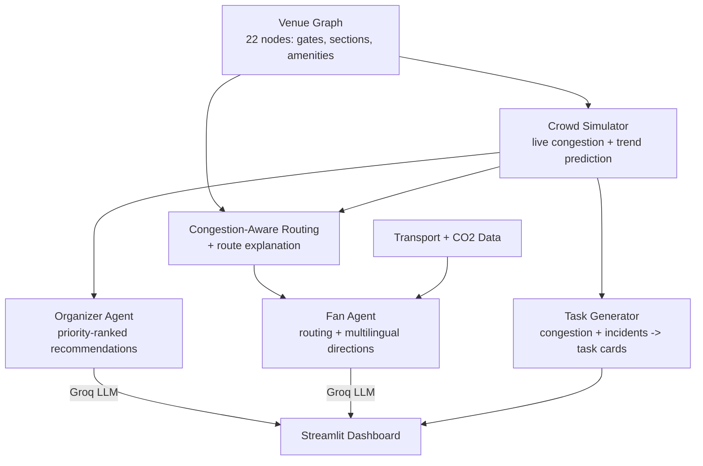

# 🏟️ StadiumMind

**A GenAI-powered command center for smart stadiums — one shared crowd-intelligence layer that powers organizer decisions, fan navigation (inside the venue and getting there), and a volunteer/staff task board.**

Built for the PromptWars 2026 "Smart Stadiums & Tournament Operations" challenge.


---

## 🚀 Live Demo

**Try it now: [stadiummind.streamlit.app](https://stadiummind.streamlit.app/)**

No setup needed — it's deployed and running in mock mode by default (see [Getting Started](#getting-started) below to run it locally with a real Groq key for live AI output).

---

## The Idea

Most crowd-management solutions treat "help organizers" and "help fans" as two separate features bolted together. StadiumMind treats them as **one system serving all four groups the brief names — fans, organizers, volunteers, and venue staff:**

- A **venue graph** models the stadium — gates, seating sections, restrooms, food courts, medical room, parking, and more.
- A **live crowd simulator** tracks congestion at every location (standing in for real sensors/cameras), including short-term trends.
- The **Organizer Agent** reads that data and gives staff a prioritized, structured action plan in real time.
- The **Fan Agent** reads the *exact same* data to route fans through the *least crowded* path to wherever they're going — and explains why that route was chosen. It also compares transit options (metro/bus/shuttle/car) for **getting to** the stadium, surfacing the greenest choice and its CO₂ savings.
- The **Volunteer & Staff Board** turns that same congestion + incident data into assignable task cards — a dedicated view for the two groups the original build didn't yet serve.

Same data, three views: whatever tells an organizer "Gate B is about to be a problem" is the same intelligence quietly routing fans away from Gate B, and the same intelligence that puts "assist at Gate B" on a volunteer's task list.



---

## Features

**📊 Organizer Dashboard**
- Live, color-coded congestion map (interactive, auto-refreshing)
- Predictive trends — not just "85/100 congested" but "up 22% recently, ~3 updates from critical"
- Structured incident logging (description, location, severity, timestamp), sorted by urgency
- AI-generated, priority-ranked recommendations with simulated impact estimates
- **Sustainability Impact panel** — running total of estimated CO₂ saved this session by fans choosing greener transit over driving alone

**🧭 Fan Assistant**
- *Navigate inside the venue:* congestion-aware routing that dynamically avoids crowded areas, not just the shortest path, with a plain-English explanation of *why* a route was chosen
- *Getting to the stadium:* compares metro, bus, shuttle-from-parking, and driving for reaching a specific gate — times plus a real CO₂-per-trip estimate for each, with the greenest option called out
- Multilingual directions and transit comparisons (English, Hindi, Spanish, French)

**🦺 Volunteer & Staff Board**
- Assignable task cards generated directly from live congestion hotspots and open incidents — the same data the Organizer Agent reasons over, presented as a to-do list instead of a paragraph
- Assign a name and track status (Open → Assigned → Resolved) per task; refreshing the board adds new tasks without touching ones already assigned
- Task descriptions can be translated on demand (English, Hindi, Spanish, French) — the same translate-with-mock-fallback pattern the Fan Assistant uses, so a Cup-scale international volunteer team isn't left with an English-only board

**♿ Accessibility**
- Every congestion score is shown as visible text, not conveyed by color alone
- Text-table and step-by-step list equivalents for every visual chart

**🔌 Runs without an API key**
- Ships with a fully-functional mock mode — the whole app works end-to-end with realistic, data-driven placeholder responses even with no LLM key configured. Add a real key and it switches to live AI output automatically.

---

## Problem Statement Coverage

The brief names eight themes and four groups to help. Every one is covered:

| Theme | How |
|---|---|
| Navigation | Congestion-aware in-venue routing (Fan Assistant) |
| Crowd management | Live congestion simulation + trend prediction |
| Accessibility | Text equivalents for every visual element |
| Operational intelligence | Organizer Agent's structured recommendations |
| Real-time decision support | Auto-refreshing dashboard + priority-ranked actions |
| Multilingual assistance | 4-language directions/transit comparisons (Fan Assistant) + translated task cards (Volunteer & Staff Board) |
| Transportation | "Getting to the Stadium" transit comparison |
| Sustainability | CO₂-per-trip estimates + session-wide savings tracker |

| Group | How |
|---|---|
| Fans | Fan Assistant (in-venue routing + transportation) |
| Organizers | Organizer Dashboard |
| Volunteers / venue staff | Volunteer & Staff Board |

---

## Tech Stack

Python · Streamlit · NetworkX · Plotly · Groq (Llama 3.3 / 3.1)

---

## Project Structure

```
stadiummind/
├── core/
│   ├── venue.py           # The stadium as a graph
│   ├── congestion.py      # The 0-100 scale: thresholds + label, one source for all of them
│   ├── crowd_sim.py       # Live congestion + trend simulation
│   ├── routing.py         # Congestion-aware pathfinding + route explanation
│   ├── incidents.py       # Structured incident model
│   ├── transport.py       # Mock transit options + CO2/sustainability scoring
│   ├── tasks.py           # Congestion/incidents -> volunteer & staff task cards
│   ├── graph_layout.py    # Positions nodes for visualization
│   └── visualization.py   # Interactive Plotly congestion map
├── agents/
│   ├── llm_client.py      # The one Groq client + the one call-with-mock-fallback policy
│   ├── organizer_agent.py # Decision-support AI
│   └── fan_agent.py       # Navigation + transit comparison + translation AI
├── app.py                 # Streamlit dashboard (3 tabs)
├── pyproject.toml         # Ruff + mypy configuration
├── requirements.txt
├── requirements-dev.txt   # pytest, ruff, mypy
├── .env.example
└── tests/                 # conftest.py pins mock mode - the suite never hits the network
```

---

## Getting Started

```bash
# 1. Clone and enter the project
git clone https://github.com/DeemonDuck/StadiumMind.git
cd StadiumMind

# 2. Create a virtual environment
python -m venv venv
venv\Scripts\activate        # Windows
source venv/bin/activate     # Mac/Linux

# 3. Install dependencies
pip install -r requirements.txt

# 4. (Optional) Add a free Groq API key for live AI output
cp .env.example .env
# edit .env and paste your key — get one free, no card required, at console.groq.com

# 5. Run it
streamlit run app.py
```

Without a key, the app runs fully in **mock mode** — every feature works, responses are just clearly labeled placeholders instead of live-generated text.

## Testing

```bash
pip install -r requirements-dev.txt
python -m pytest tests/ -v
```

65 tests covering the venue graph, crowd simulation, the shared congestion bands, congestion-aware routing, incident logic, transit/CO₂ scoring, volunteer task generation, the Streamlit app's three tabs (via `streamlit.testing.v1.AppTest`), and the deterministic (non-LLM) parts of both agents — prompt builders and mock-mode fallbacks. Mock mode is pinned by an autouse fixture in `tests/conftest.py`, so the suite is hermetic: it never calls the network and passes identically with or without a real API key configured. Runs automatically on every push via GitHub Actions across Python 3.10–3.12, alongside a separate lint (`ruff check .`) and type-check (`mypy .`) job.

---

## Notes on Design Decisions

- **Mock mode isn't a shortcut — it's a resilience feature.** Both agents degrade gracefully to data-driven mock responses if no key is configured or the API is briefly unavailable, so a live demo never just crashes.
- **That resilience policy is written down exactly once.** Every LLM call in the project goes through a single `complete(prompt, ..., fallback)` in `agents/llm_client.py`, which owns all three ways a call can fail to produce usable text (no key, empty content, `OpenAIError`). It used to be copy-pasted into all four call sites — but the fallback *is* the resilience feature, so it's the last thing that should have four copies drifting apart.
- **Congestion has one definition, not three.** The 0–100 thresholds live only in `core/congestion.py`. The map, the agents, and the task board all read from it, so they can't quietly disagree about what "critical" means.
- **The test suite is hermetic.** `tests/conftest.py` pins mock mode, so the suite makes no network calls and passes identically whether or not the machine running it has a real API key — rather than being green only because CI happens to lack one.
- **Congestion-aware routing uses a squared penalty**, not a linear one — mild congestion barely affects the route, but near-critical congestion is avoided hard. This was tuned empirically to reroute realistically without needing extreme parameter values.
- **The venue's layout is computed, not hand-placed** — a small pure-Python algorithm positions every node relative to its neighbors, so the map stays sensible even as the venue graph grows.
- **Volunteer/staff tasks are generated from data, not parsed from the Organizer Agent's LLM text.** Task cards come from a plain function over the same congestion/incident data the organizer agent reads — deterministic and independently testable, rather than fragile regex/parsing of a freeform AI paragraph.
- **CO₂ figures are a relative comparison, not a compliance-grade audit.** The per-km emissions rates are widely-cited rough averages; what matters for this feature is the ordering (metro < shuttle < bus < driving alone) and giving fans a concrete number, not scientific precision.

For the full step-by-step build log, bugs caught along the way, and reasoning behind each decision, see [BUILD_LOG.md](BUILD_LOG.md).

---

## Author

**Ridham** — [@DeemonDuck](https://github.com/DeemonDuck)

## License

This project is licensed under the [PolyForm Noncommercial License 1.0.0](LICENSE).

Copyright © 2026 Ridham Taneja. Commercial use requires prior written permission — reach out at your-ridham643@gmail.com.